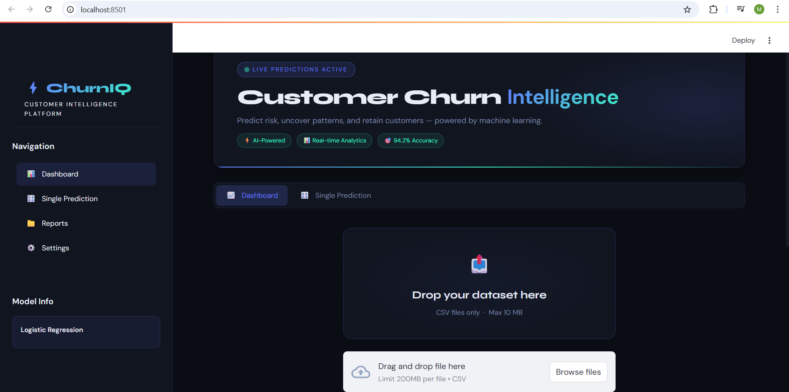
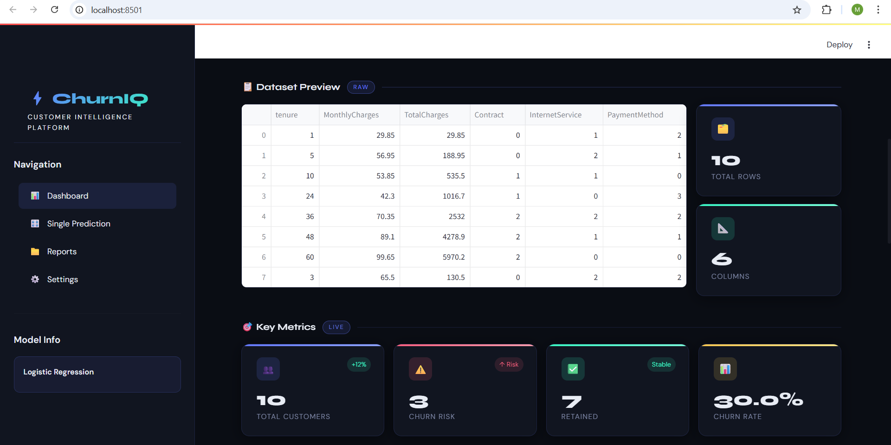
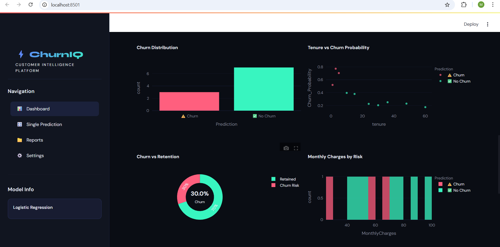
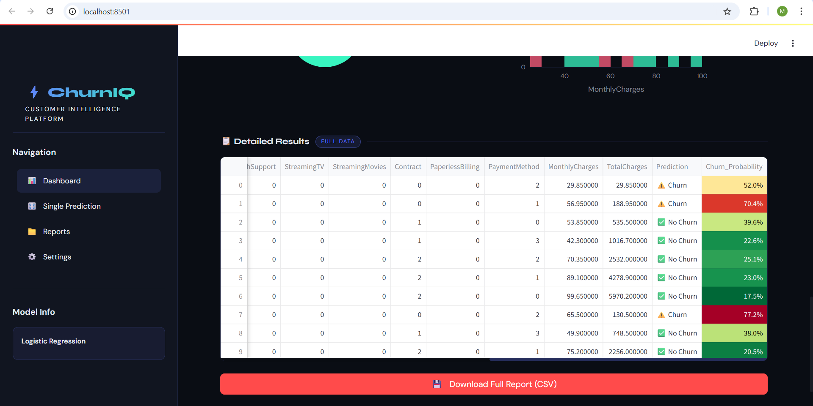

# ⚡ ChurnIQ — Customer Churn Prediction Dashboard

AI-powered analytics platform to predict customer churn, analyze risk patterns, and help businesses retain customers.
Built using **Python, Streamlit, Scikit-learn, and Plotly.**

This project demonstrates **end-to-end machine learning deployment**, from data preprocessing and model training to an interactive business dashboard.

---

# 📸 Dashboard Preview

### Main Dashboard



---

# 📊 Dashboard Screenshots

### Customer Churn test dataset



### Churn Risk Distribution Dashboard



### Prediction Results Dashboard



These screenshots show the **interactive business intelligence dashboard**, churn predictions, and data visualizations generated after uploading a dataset.

---

# 🚀 Features

## 📊 Business Intelligence Dashboard

* Upload customer dataset (CSV)
* Automatically generate churn predictions
* Interactive analytics dashboard

## 📈 Key Performance Metrics

* Total Customers
* High Risk Customers
* Retained Customers
* Overall Churn Rate

## 🤖 AI-Powered Predictions

* Batch churn prediction for multiple customers
* Real-time single customer prediction
* Probability-based churn risk analysis

## 📊 Advanced Data Visualizations

Interactive charts built with **Plotly**

* Customer tenure vs churn scatter plot
* Monthly charges distribution
* Churn risk donut chart
* Customer churn probability distribution

## 📄 Exportable Reports

Download full prediction results as **CSV report**

## 🎨 Professional Dashboard UI

* Microsoft-style professional layout
* Responsive design
* Interactive analytics
* Business-ready dashboard interface

---

# 🗂️ Project Structure

```
customer-churn-prediction-dashboard/
│
├── app.py
│
├── images/
│   ├── Screenshot1.png
│   ├── Screenshot2.png
│   └── Screenshot3.png
│
├── model/
│   ├── churn_model.pkl
│   ├── scaler.pkl
│   └── model_columns.pkl
│
├── notebook/
│   └── churn_analysis.ipynb
│
├── data/
│   └── WA_Fn-UseC_-Telco-Customer-Churn.csv
│
└── README.md
```

---

# ⚙️ Technologies Used

| Technology   | Purpose                    |
| ------------ | -------------------------- |
| Python       | Core programming language  |
| Streamlit    | Interactive dashboard      |
| Pandas       | Data processing            |
| NumPy        | Numerical computing        |
| Scikit-learn | Machine learning model     |
| Plotly       | Interactive visualizations |

---

# 📦 Installation

## 1️⃣ Clone Repository

```
git clone https://github.com/MansiRaut45/customer-churn-prediction-dashboard
cd customer-churn-prediction-dashboard
```

## 2️⃣ Create Virtual Environment

### Windows

```
python -m venv venv
venv\Scripts\activate
```

### Mac / Linux

```
python3 -m venv venv
source venv/bin/activate
```

## 3️⃣ Install Dependencies

```
pip install -r requirements.txt
```

## 4️⃣ Run Application

```
streamlit run app.py
```

Open in browser:

```
http://localhost:8501
```

---

# 📊 Machine Learning Model

| Attribute    | Details                      |
| ------------ | ---------------------------- |
| Model        | Logistic Regression          |
| Problem Type | Binary Classification        |
| Dataset      | Telco Customer Churn Dataset |
| Framework    | Scikit-learn                 |

### Key Features Used

* tenure
* MonthlyCharges
* TotalCharges
* Contract
* PaymentMethod
* InternetService
* OnlineSecurity
* TechSupport
* StreamingTV
* StreamingMovies
* and other encoded categorical features

The model predicts the **probability that a customer will leave the company**.

---

# 📊 How to Use

## Dashboard (Batch Prediction)

1. Open the **Dashboard tab**
2. Upload a CSV dataset
3. The system automatically:

   * processes data
   * aligns columns
   * generates predictions
4. View business insights through charts
5. Download prediction report

### Expected CSV Columns

```
tenure
MonthlyCharges
TotalCharges
gender
SeniorCitizen
Partner
Dependents
PhoneService
MultipleLines
InternetService
OnlineSecurity
OnlineBackup
DeviceProtection
TechSupport
StreamingTV
StreamingMovies
Contract
PaperlessBilling
PaymentMethod
```

---

# 🔮 Single Customer Prediction

1. Navigate to **Single Prediction tab**
2. Enter customer information using sliders
3. Click **Predict Churn Risk**
4. View churn probability instantly

---

# 🧠 Model Training

You can retrain the model using your own dataset.

Example training code:

```python
from sklearn.linear_model import LogisticRegression
from sklearn.preprocessing import StandardScaler
import pickle

scaler = StandardScaler()
X_scaled = scaler.fit_transform(X)

model = LogisticRegression(max_iter=1000)
model.fit(X_scaled, y)

pickle.dump(model, open("model/churn_model.pkl", "wb"))
pickle.dump(scaler, open("model/scaler.pkl", "wb"))
pickle.dump(list(X.columns), open("model/model_columns.pkl", "wb"))
```

---

# 📈 Business Value

This system helps companies:

* Predict which customers are likely to leave
* Understand key churn patterns
* Build customer retention strategies
* Reduce customer loss and revenue decline

---

# 👩‍💻 Author

**Mansi Raut**

Bachelor of Engineering — Information Technology
Machine Learning & Data Analytics Enthusiast

GitHub: https://github.com/MansiRaut45
LinkedIn: https://linkedin.com/in/mansi-raut2804

---
